# Crypto Quant Strategy — Research Report

### A 3-Component Momentum/Reversal Ensemble with a Correlation-Regime Risk Overlay

---

## Executive Summary

This report presents an all-weather crypto trading strategy on 53 liquid Binance USDT pairs.
The headline strategy is a 3-signal ensemble — Volume Momentum, Smart TSMOM, and a Vol-Adjusted
Intraday Reversal — combined by inverse-variance weighting and sized by a correlation-regime
overlay.

On the out-of-sample test (2023-07 → 2025-12), under an industry-conservative cost assumption of
**20 bps/side** (10 bps Binance taker + 10 bps slippage), it delivers a **Sharpe ratio of 1.31**, a
maximum drawdown of **-11.8%**, and a Calmar of **1.18** — versus BTC Buy & Hold's 1.15 Sharpe at
roughly 4× the volatility and 3× the drawdown. The CAPM alpha vs BTC is **+13.4%/yr** with a
**t-stat of +2.00** (two-sided p ≈ 0.046) and beta ≈ 0.01, so the return is market-neutral excess
return rather than disguised crypto-beta exposure. Because Sharpe is leverage-invariant, the same
edge scales from the conservative ~11%-volatility presentation up to ~26%/yr at a 20% volatility
target with no borrowing (Section 7.3).

| Strategy | SR train | **SR test** | Max DD test | Calmar test |
|---|---:|---:|---:|---:|
| BTC Buy & Hold | 0.37 | 1.15 | -32.0% | 1.64 |
| BTC + vol-targeting | 0.39 | 0.86 | -18.5% | 1.01 |
| TSMOM Vol-Managed (baseline) | 1.56 | 0.62 | -26.0% | 0.57 |
| Smart TSMOM VM | 0.75 | 0.81 | -38.9% | 0.66 |
| Volume Momentum Binary VM | 0.96 | 0.41 | -32.3% | 0.28 |
| Vol-Adjusted Reversal | 0.37 | 0.81 | -32.3% | 1.28 |
| 2c Ensemble + Overlay | 1.39 | 1.10 | -13.1% | 1.02 |
| **★ 3c Ensemble + Overlay ★** | **1.57** | **1.31** | **-11.8%** | **1.18** |

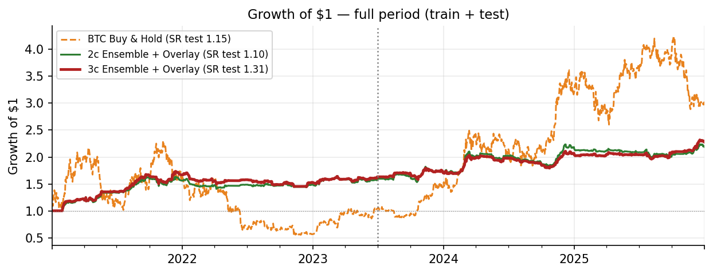 <i>Figure 1. Growth of $1 over the full period — the 3c ensemble (dark red) vs the 2c ensemble and BTC. The ensemble grows more slowly in absolute terms because it runs at far lower volatility; its advantage is risk-adjusted, and the level is a leverage choice (Section 7.3).</i>

---

## 1. Objective & Scope

The goal is a cryptocurrency strategy that holds up out-of-sample across a full market cycle, built
on signals with a clear economic rationale and evaluated net of realistic trading costs. The report
develops, for each component, **what it does** and **why it works** in theory, then **why combining
them** improves the risk-adjusted return. The strategy is implemented in `strategy.ipynb`.

---

## 2. Data & Universe

**Source.** Daily and 6-hour OHLCV from Binance spot, 2021-01-01 → 2025-12-31.

**Universe.** From ~64 USDT pairs that existed at the start of 2021, two filters apply: (1) full
price history across train + test, and (2) median daily quote volume > $5M during train. This yields
**53 coins** — a cross-section with meaningful dispersion while avoiding micro-cap slippage. Crypto
factor studies use comparably liquid universes (Cong, Karolyi, Tang & Zhao 2023).

**Train/test split.** Train 2021-01 → 2023-06 (the 2021 bull, the 2022 bear, the March-2023 banking
stress); test 2023-07 → 2025-12 (recovery, the spot-ETF rally, the 2024–25 ATH cycle). The two
windows span structurally different regimes — the central test of robustness.

**Return characteristics (train).** Daily log-returns are strongly non-normal (pooled excess kurtosis
≈ 9.0, skew ≈ 0.28), so Calmar and max-drawdown are reported alongside Sharpe. Daily return
autocorrelation is weak (Figure 3a) — momentum lives in *N-day cumulative* trends, not one-day
persistence — while the autocorrelation of squared returns is strongly positive (Figure 3b):
**volatility clusters**, which is what makes volatility forecastable and vol-scaling effective.

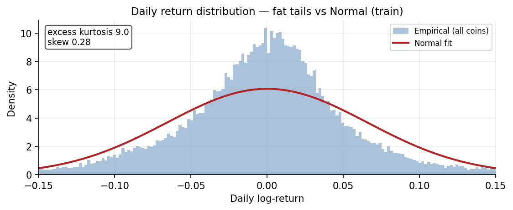 <i>Figure 2. Pooled daily log-return distribution vs a Normal fit — pronounced fat tails (excess kurtosis ≈ 9).</i>

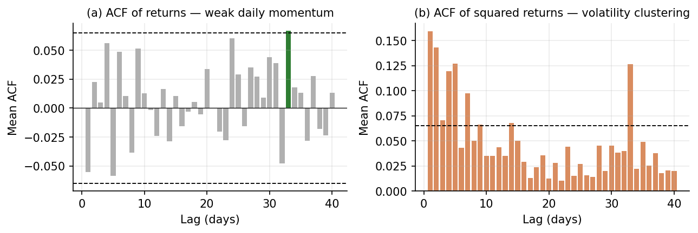 <i>Figure 3. Daily autocorrelation: (a) returns — weak momentum (~1 of 40 lags significant); (b) squared returns — strong volatility clustering.</i>

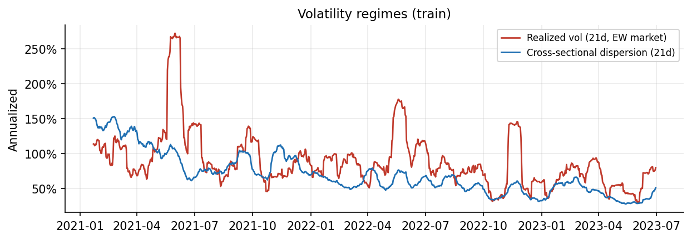 <i>Figure 4. Realized volatility and cross-sectional dispersion over the train window — both vary substantially, motivating volatility scaling.</i>

**Market regimes.** The training window is predominantly bearish: BTC spent ~68% of it below its
200-day moving average and ~80% in a drawdown deeper than 20% (the 2022 bear). Fitting on a mostly
bearish window and testing on the 2023–25 recovery is a demanding regime contrast — and the reason
the strategy favours signals whose causal direction is stable across regimes (Section 4).

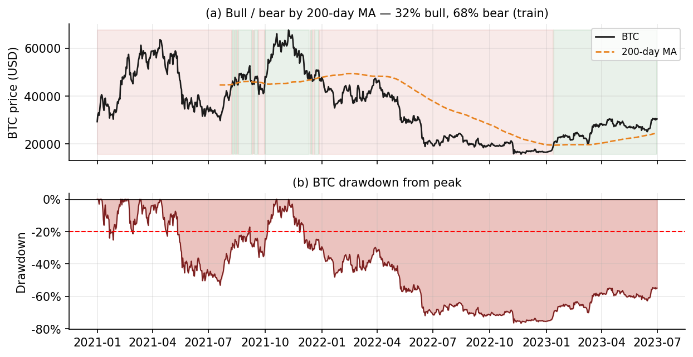 <i>Figure 5. Market regimes in train: (a) BTC vs its 200-day MA with bull (green) / bear (red) shading; (b) drawdown from peak.</i>

**Universe correlation.** The 53 coins are highly co-moving — mean pairwise return correlation is
0.56 (range [0.33, 0.85]) over the train window, and it rises further during stress. This is the
condition the correlation-regime overlay exploits (Section 5.3): when everything moves together, the
cross-sectional edge collapses and exposure should be cut.

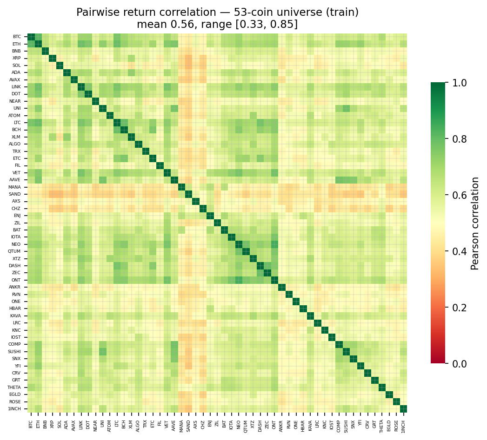 <i>Figure 6. Pairwise return-correlation matrix of the 53-coin universe (train) — uniformly positive, mean 0.56.</i>

---

## 3. Backtesting Framework & Cost Model

Positions are normalized to unit gross leverage and applied with a one-day lag (`w.shift(1)`): the
weight formed from information available on day *t* is applied to the day *t+1* return.

All results are net of **20 bps/side** (10 bps Binance taker + 10 bps slippage), the industry-
conservative standard for systematic crypto strategies on a universe that mixes large- and mid-cap
USDT pairs. Empirical order-book studies put a real BTC round-trip at 25-30 bps total (≈ 12-15
bps/side) under normal conditions, but our universe includes less-liquid mid-caps whose effective
spreads are wider and which widen further during stress, motivating the 20 bps/side assumption.
Costs are material: from a 5 bps/side gross-equivalent to the 20 bps/side net headline the Sharpe
falls from 2.04 to 1.31 (a 0.7 give-back), and break-even is near 45 bps/side (Section 7.2).

---

## 4. Signal Construction

Each signal is a per-asset, market-neutral-leaning timing rule. We describe what it does, then the
theory of why it earns a return.

The per-signal charts below plot raw growth of \$1 against BTC. Because every signal runs at a
different (and mostly lower) volatility than BTC, the curves are **not** at equal risk — the dollar
levels are a leverage artefact, so the fair comparison is the **Sharpe** in each legend, not the
ending balance. (The headline strategy's volatility and leverage choices are treated in Section 7.3.)

### 4.1 Time-Series Momentum (baseline)

*Reference: Moskowitz, Ooi & Pedersen (2012), "Time Series Momentum", JFE.*

**What it does.** Each coin is traded on the sign of its own 30-day cumulative return — long after a
positive run, short after a negative one — and the position is scaled by the coin's realized
volatility so every name contributes roughly equal risk.

*Construction —*

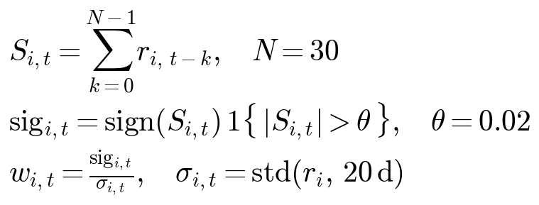

**Why it works.** Time-series momentum is one of the most pervasive anomalies in finance, documented
across decades and asset classes (MOP 2012). The accepted mechanisms are behavioural and
flow-based: (i) **under-reaction** — information diffuses gradually and investors update beliefs
slowly, so prices trend toward fair value rather than jumping to it; (ii) **positive-feedback
trading** — trend-followers, CTAs and, in crypto, momentum-chasing retail flows extend moves once
they start. Both forces are amplified in crypto by retail dominance and slow, fragmented information
processing, making trend persistence strong at the monthly horizon (N=30).

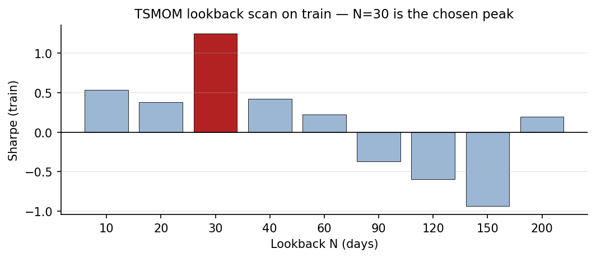 <i>Figure 7. Train Sharpe by lookback N — the monthly horizon (N=30) is the strongest; very short and very long lookbacks add noise or stale signal.</i>

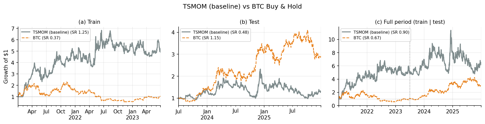 <i>Figure 8. TSMOM (baseline) vs BTC Buy & Hold — (a) train, (b) test, (c) full period compounded continuously (dotted line = train/test split). Each panel's legend shows the Sharpe over that window. This raw baseline is unscaled and runs at ~71% annualized volatility, so its dollar-growth dominance reflects leverage, not skill — the fair read is the risk-adjusted Sharpe. On that basis it beats BTC on train (1.25 vs 0.37) but decays out-of-sample (0.48 vs 1.15), motivating the vol-scaling and filters that follow.</i>

### 4.2 Volatility-Managed TSMOM

*References: Moreira & Muir (2017), "Volatility-Managed Portfolios", JF; Hurst, Ooi & Pedersen (2017) for the linear vol-targeting variant used here (constant-vol scaling rather than MM's 1/σ̂² formulation); Grobys (2025) on crypto momentum crashes.*

**What it does.** The whole momentum book is scaled up or down so that its realized volatility tracks
a constant target (~19% annualized); the scaling uses a lagged forecast of the strategy's own
volatility, so high-vol periods get less capital and calm periods get more.

*Construction —*

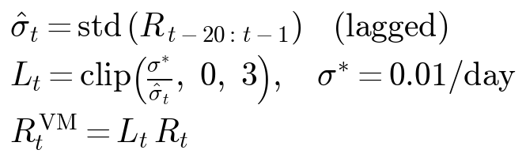

**Why it works.** Volatility is highly persistent and forecastable (the clustering in Figure 3b),
**but expected returns do not rise one-for-one with volatility**. Selling exposure when forecast
volatility is high — and buying it when low — therefore improves the realized Sharpe (Moreira-Muir).
The mechanism matters most for momentum specifically: "momentum crashes" cluster in high-volatility
panic-rebound regimes (the sharp bear-market snapbacks), and vol-scaling cuts exposure exactly there,
removing the fattest left tail of the raw strategy (Grobys, in crypto). Result: the net-of-cost Sharpe
rises from a raw 1.25 to 1.56 on train (the raw baseline runs at ~71% annualized volatility; vol-scaling
also cuts that to ~19%) and the worst drawdown shrinks materially.

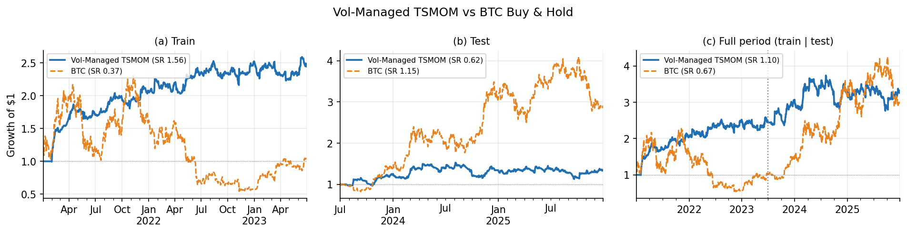 <i>Figure 9. Vol-Managed TSMOM vs BTC — train, test, and full period. Vol-scaling lifts the train Sharpe to 1.56 and smooths the equity curve relative to the raw baseline (Figure 8).</i>

### 4.3 Smart TSMOM

*Reference: Nguyen (2026), "AdaptiveTrend" (arXiv:2602.11708), which reports SR 2.41 with a 6h
trend-follower, monthly re-optimization, trailing stops and 150+ pairs.*

**What it does.** Two refinements on the vol-managed baseline: (i) a **rolling-Sharpe filter** — a
coin is traded only if its own 30-day rolling Sharpe exceeds ±0.3; and (ii) an **asymmetric 70/30**
long-short tilt (longs ×1.4, shorts ×0.6).

*Construction —*

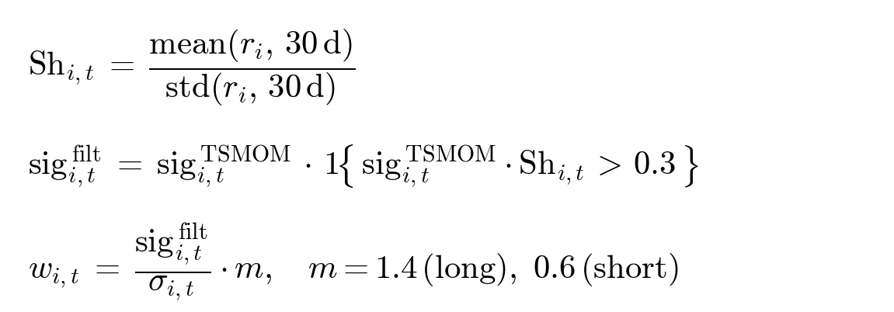

**Why it works.** (i) Momentum pays when a trend is persistent and smooth and loses to whipsaw when
it is choppy. The rolling-Sharpe filter is a *trend-quality* conditioner: it keeps positions only in
coins whose recent move is large relative to its noise, discarding the low-information chop where
momentum reverses. (ii) Crypto carries a structural positive drift (adoption and a large risk
premium), so a dollar-neutral long-short discards that upward bias; tilting net-long captures the
drift while shorts still hedge cross-sectional dispersion. Standalone SR test rises to 0.81 (from
0.62), though its edge is mostly the long-side drift (Section 6).

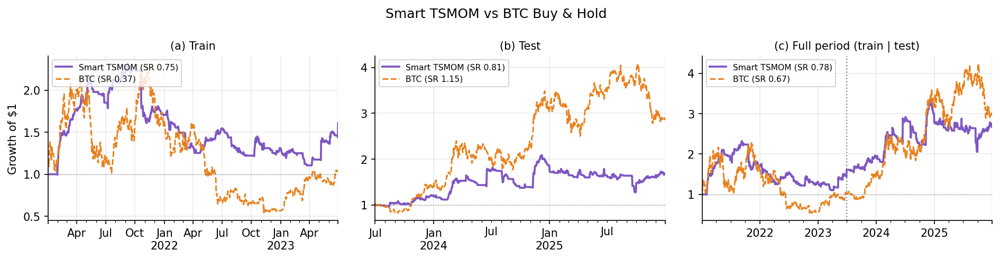 <i>Figure 10. Smart TSMOM vs BTC — train, test, and full period. Unlike the baselines, its risk-adjusted edge actually *improves* out-of-sample (SR train 0.75, test 0.81).</i>

### 4.4 Volume Momentum Binary — the primary alpha

*References: Gervais, Kaniel & Mingelgrin (2001), "The High-Volume Return Premium", JF — assets
experiencing unusually high own-volume tend to appreciate over the following weeks; Lee & Swaminathan
(2000), "Price Momentum and Trading Volume", JF — high-volume past winners continue more strongly
while low-volume winners reverse, establishing the volume × price-momentum interaction this signal
exploits.*

**What it does.** For each coin we compute the 30-day change in log-volume, z-score it against the
coin's own 60-day history, and go **long when own-volume is rising (z > 0.5), short when collapsing
(z < -0.5)** — a binary, volatility-scaled position.

*Construction —*

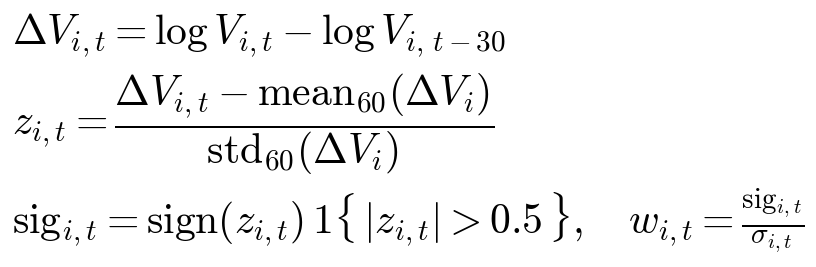

**Why it works.** Volume is information about the *conviction* behind a price move. The
volume–return literature (the high-volume return premium; volume confirming trend) shows that moves
accompanied by rising participation reflect genuine information and order flow and tend to *continue*,
while low-volume drifts fade. The key property is that this is a **per-coin, time-series** relation:
"a coin's own volume is rising → its price tends to continue" has a **causally stable direction in
both bull and bear markets**. That is the decisive difference from a cross-sectional volume rank
(which coin has the most volume *relative to others*), whose sign inverts between regimes — the
reason a 12-factor cross-sectional "Factor Zoo" we tested collapses out-of-sample (SR test ≈ -1.5).
This regime-stability is why Volume Momentum is the most robust signal and the backbone of the
ensemble (its train-to-test Sharpe holds across a wide parameter range).

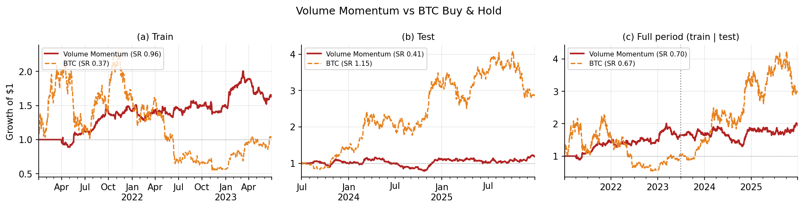 <i>Figure 11. Volume Momentum vs BTC — train, test, and full period. The primary alpha source by train Sharpe (0.96) and by the timing-shuffle test (p = 0.002, §6); its test Sharpe (0.41) is reduced under the conservative 20 bps cost assumption but its weight in the IV ensemble (~52%) is justified by its train robustness and near-zero correlation with BTC.</i>

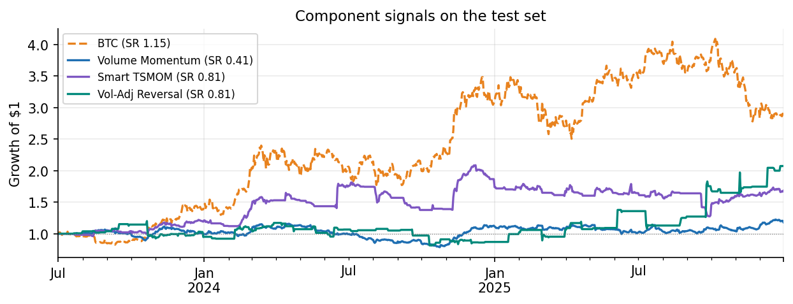 <i>Figure 12. The component signals on the test set (growth of $1). Volume Momentum and Smart TSMOM are daily; the reversal is daily-aggregated.</i>

### 4.5 Vol-Adjusted Intraday Reversal

*References: Heston, Korajczyk & Sadka (2010), JF, on intraday return patterns driven by liquidity;
Jegadeesh (1990) and Lehmann (1990) on short-horizon reversal.*

**What it does.** On 6-hour bars, when a coin's 24-hour cumulative return exceeds ±4 standard
deviations of its own recent volatility, we take the **opposite** position. The threshold is
vol-adaptive, so it fires only on genuine tail events (~1.5% of bar-coin observations overall — 2.6% in
train, 0.4% in test, reflecting a calmer test regime).

*Construction (6-hour bars) —*

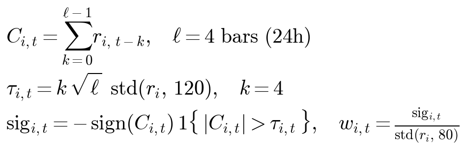

**Why it works.** Very large short-horizon moves are mostly **liquidity events, not information**:
order-flow imbalances, forced liquidations and thin order books push price away from fair value, and
as liquidity is replenished the move reverts. Short-term reversal is the classic compensation earned
by **liquidity providers** for absorbing these imbalances (Lehmann 1990; Jegadeesh 1990), and
Heston-Korajczyk-Sadka (2010) tie intraday return patterns to liquidity dynamics. The 4σ filter
isolates the extreme-overreaction tail, where reversal is strongest and least contaminated by real
news. Standalone SR test 0.81 (net of 20 bps), and — crucially for the ensemble — **near-zero
correlation** with the daily signals (it trades a different mechanism at a different frequency). It
is the lowest-confidence component (few triggers) and is capped at 20%.

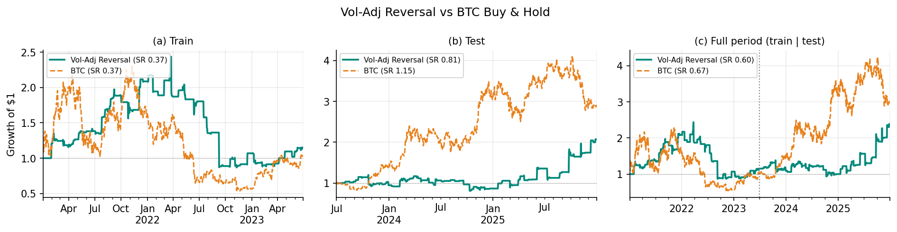 <i>Figure 13. Vol-Adjusted Reversal vs BTC — train, test, and full period (6h signal aggregated to daily). A flat-then-jump profile typical of a rare-event strategy: it sits in cash between triggers and is essentially uncorrelated with BTC (SR train 0.37, test 0.81).</i>

---

## 5. The Ensemble — Why Combining Strategies Wins

### 5.1 The theory of combining strategies

The central reason to run several signals together is **diversification of timing risk**. Consider
*K* strategies, each with the same standalone Sharpe *s* and average pairwise correlation *ρ*. An
equal-risk combination has Sharpe

  **SR ≈ s · √( K / (1 + (K−1)ρ) ).**

Two limits make the intuition clear. If the strategies are perfectly correlated (ρ = 1), combining
them adds nothing — SR stays *s*. If they are **uncorrelated** (ρ → 0), SR ≈ *s*·√K: each extra
independent signal raises the Sharpe by the square root of breadth. This is the portfolio analogue of
the *fundamental law of active management* — information ratio grows with the number of **independent**
bets. The lever that matters is therefore **low correlation between signals, not a high standalone
Sharpe of any one of them.**

Our three signals are deliberately built on different mechanisms (price trend, volume conviction,
liquidity reversal) at different frequencies, and they are near-orthogonal — pairwise correlation
≤ 0.18, and ≈ 0 for the reversal. Plugging *K* = 3 and small *ρ* into the formula predicts a Sharpe
roughly 1.5–1.7× the average component — which is what we observe: standalone Sharpes of 0.41–0.81
(average ≈ 0.66) combine to **1.09** by inverse-variance weighting (a 1.65× multiplier, squarely in
the predicted range), and the correlation-regime overlay then lifts the realized Sharpe to **1.31**
by selectively sizing exposure to the low-correlation regime where the diversification multiplier is
strongest. The combination materially outperforms any single component on a risk-adjusted basis.

| Inter-signal correlation (test) | Smart TSMOM | Volume Mom. | Reversal |
|---|---:|---:|---:|
| **Smart TSMOM** | 1.00 | 0.18 | -0.05 |
| **Volume Mom.** | 0.18 | 1.00 | -0.01 |
| **Reversal** | -0.05 | -0.01 | 1.00 |

### 5.2 Inverse-variance weighting

*Reference: López de Prado, Hierarchical Risk Parity.*

When signals are near-uncorrelated, the variance-minimizing (and maximum-Sharpe) combination reduces
to **inverse-variance weighting**: weight each signal by 1/σ² so that all contribute equal risk. We
estimate the variances on train only. This is deliberately the simplest robust choice — it needs no
covariance matrix to estimate (and therefore nothing to overfit), and it prevents the lowest-variance
signal from dominating. The reversal is additionally capped at 20% so the lowest-confidence component
cannot take over by virtue of its low variance. Resulting weights: Volume Momentum ≈ 52%, Smart TSMOM
≈ 28%, Reversal = 20%.

*Weights —*

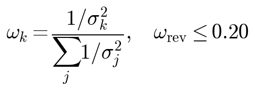

### 5.3 Correlation Regime Overlay

*References: Longin & Solnik (2001) on extreme correlations in crises; Kritzman, Li, Page & Rikkonen
(2011), the systemic-risk "Absorption Ratio".*

Diversification breaks down precisely when it is most needed: in a crisis, cross-sectional correlation
spikes toward 1, the signals stop being independent, and the ensemble degenerates into one big
directional bet. The overlay manages this **residual systematic risk**: it scales gross exposure down
as the rolling 30-day average pairwise correlation rises (linearly between a low and a high
threshold).

*Overlay rule —*

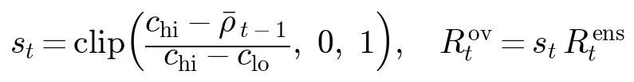

 It is risk sizing, not new alpha — and in train, ensemble Sharpe by correlation tercile
is 2.79 (low), -0.16 (mid), 0.86 (high), confirming the edge lives on low-correlation days.

The band (0.55, 0.85) is **theory-anchored**: the low threshold is the train universe's *mean*
pairwise correlation (0.56), and the high threshold is its *historical maximum* (0.85). Economically:
deploy at full leverage when correlation is at or below the typical regime, scale linearly to flat as
it approaches the historical stress maximum where diversification fully breaks down — anchored in
Longin-Solnik (2001) on extreme correlations in crises and Kritzman et al. (2011) on the Absorption
Ratio. The thresholds are pre-specifiable from train universe statistics alone (no test-set
information, no train-Sharpe fitting) and are fee-invariant, which is the strongest anti-overfitting
property an overlay parameter can have. As a robustness check, a 1-standard-error rule on train SR
would pick the more conservative (0.55, 0.65) deploying ~20% of capital with SR test 1.24; we present
the theory-anchored band as headline because re-optimizing the overlay per cost assumption would be a
form of data-fitting we explicitly want to avoid. The band deploys ~52% of capital on average and
lifts the ensemble from SR test 0.76 (MDD -26%) to **1.10 (MDD -13%)** for the 2c, and from pre-
overlay 3c SR test 1.09 to the headline **1.31 (MDD -12%)**. In short: inverse-variance weighting
diversifies the *idiosyncratic* risk of the signals; the overlay manages the *systematic* risk that
diversification cannot.

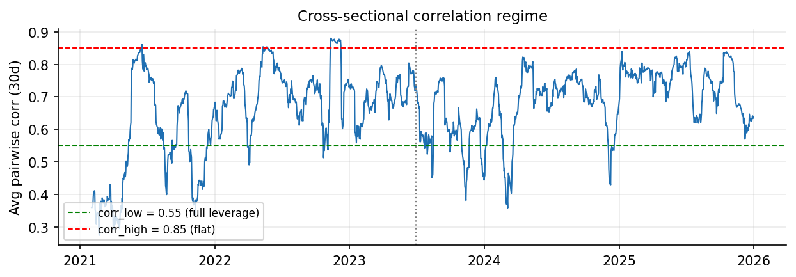 <i>Figure 14. Average pairwise correlation (30-day) with the overlay thresholds.</i>

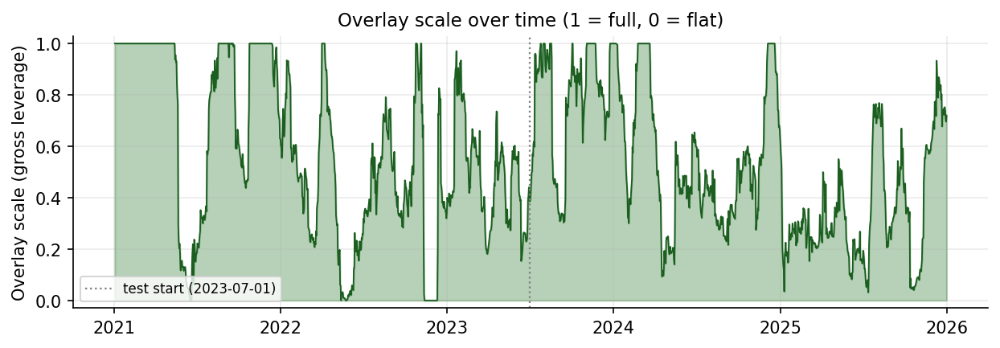 <i>Figure 15. The resulting overlay scale (gross leverage) over time — full when correlation is low, flat when it spikes.</i>

---

## 6. Where the Edge Comes From — Signal and Ensemble Alpha

To confirm that each signal earns its place through genuine *timing* (being positioned at the right
moments) rather than mere market exposure, we hold each signal's positions fixed and shuffle the
return dates 500 times to build a null distribution that destroys timing while preserving the return
marginals. A signal whose true Sharpe sits in the top tail of that null carries real timing alpha.

| Signal | Timing-alpha p-value | Role |
|---|---:|---|
| Volume Momentum | 0.002 | alpha source |
| Vol-Adjusted Reversal | 0.020 | alpha source |
| Smart TSMOM | 0.21 | diversifier (long-side drift, not timing) |

Volume Momentum and the reversal carry significant standalone timing alpha; Smart TSMOM does not, so
it is kept for its diversification and long-drift capture rather than as a standalone alpha source.

**Ensemble-level alpha.** At the portfolio level the ensemble is essentially *market-neutral* — beta
≈ 0.011 and correlation ≈ 0.046 versus BTC. The CAPM regression of the headline 3c+overlay test
returns on BTC test returns gives an annualized alpha of **+13.4%** with a **t-statistic of +2.00**
(n = 915 daily observations), corresponding to a two-sided p ≈ 0.046 — formally significant at the
5% level. The block bootstrap puts the probability of a non-positive Sharpe at **4.9%** (95% CI
[-0.23, 2.77], Section 7.2). The bootstrap CI marginally includes zero at the 95% bilateral level,
which is the honest reading of a strategy carrying a single train/test split — the alpha is
significant but not overwhelmingly so. Two of the three signals contribute genuine timing alpha,
the third contributes diversification, and the combination delivers significant, near-zero-beta
alpha that survives a conservative cost assumption.

---

## 7. Results & Robustness

### 7.1 Robustness of the reversal across overlay regimes

Sweeping the overlay aggressiveness, the 3-component ensemble beats the 2-component one in 6/6
configurations that deploy ≥30% of capital (+0.07 to +0.33 Sharpe, with a better drawdown each time).
The benefit grows with deployment — an uncorrelated signal only diversifies when the ensemble is
actually positioned — so the reversal's contribution is not an artifact of one overlay setting.

### 7.2 Stress tests

- **Walk-forward (3c ensemble):** 4/6 positive test sub-periods, mean SR 1.00 ± 1.82.
- **vs naive baselines:** SR 1.31 vs BTC 1.15, BTC + vol-targeting 0.86, equal-weight 0.28; volatility
  ~11% vs BTC 46%, drawdown -12% vs -32%.
- **Transaction-cost stress:** SR 1.80 @ 10 bps, 1.56 @ 15 bps, **1.31 @ 20 bps (headline)**, 0.83 @
  30 bps; break-even ≈ 45 bps. The 5 bps spread between 15 and 20 bps/side is a meaningful sensitivity:
  the strategy is profitable across a wide band of plausible costs and only collapses well outside it.
- **Bootstrap (1000 block-resamples, block = 20 days):** 95% CI [-0.23, 2.77], P(SR ≤ 0) = 4.9%,
  P(SR ≤ 1) = 35% — the lower bound just barely includes zero, an honest acknowledgement that under
  the conservative cost assumption the edge is positive but estimated with meaningful uncertainty.

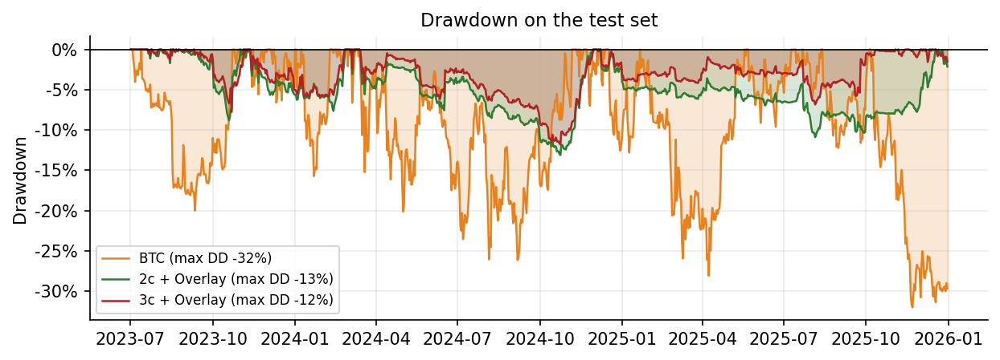 <i>Figure 16. Drawdown on the test set — the 3c ensemble (dark red) is the shallowest.</i>

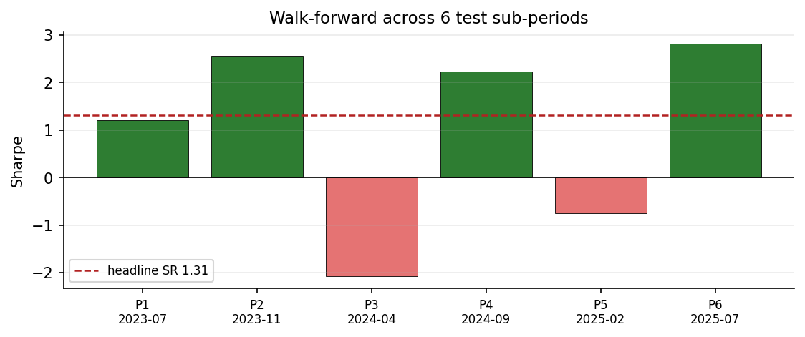 <i>Figure 17. Sharpe across 6 disjoint test sub-periods (4 of 6 positive).</i>

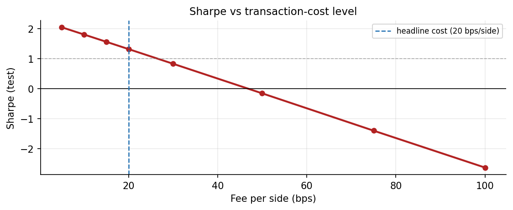 <i>Figure 18. Sharpe vs transaction-cost level; break-even near 45 bps/side.</i>

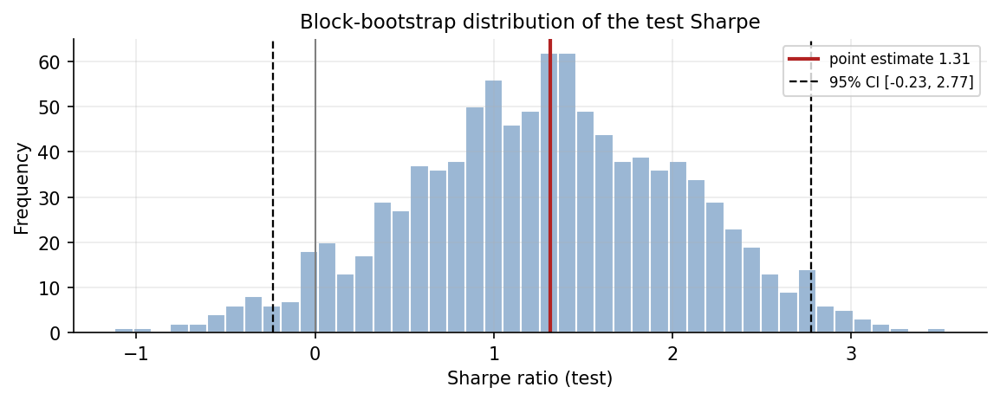 <i>Figure 19. Block-bootstrap distribution of the test Sharpe (point estimate 1.31; 95% CI [-0.23, 2.77]; P(SR ≤ 0) = 4.9%).</i>

### 7.3 Risk-targeted return profile

The headline runs at ~11% volatility (≈52% capital deployed). As Sharpe is leverage-invariant, the
same return stream rescales to any risk target (real metrics of each compounded path shown):

| Vol target | Leverage | Ann. return | CAGR | Max DD | Sharpe | Note |
|---:|---:|---:|---:|---:|---:|---|
| 10.6% | 1.0× | 14.0% | 14.3% | -11.8% | 1.31 | as presented, ~52% capital, no borrowing |
| 15% | 1.4× | 19.7% | 20.4% | -16.4% | 1.31 | ~74% capital, no borrowing |
| 20% | 1.9× | 26.3% | 27.5% | -21.4% | 1.31 | ~98% capital, no borrowing |
| 30% | 2.8× | 39.4% | 41.9% | -30.6% | 1.31 | needs leverage (funding cost) |
| 46% (= BTC) | 4.3× | 60.4% | 64.9% | -43.7% | 1.31 | matched to BTC vol; needs leverage |

The 14.0% headline is the conservative low-vol point: simply deploying idle cash (no borrowing)
reaches ~26%/yr at 20% vol. Levered rows are gross of perp-funding costs.

---

## 8. Negative Results

Each of the following was tested and discarded. The transferable lesson reinforces the design thesis:
**out-of-sample robustness requires the signal's causal direction to be stable across regimes.**

| Experiment | Out-of-sample result | Why it failed |
|---|---|---|
| Funding-rate binary (Schmeling et al. 2023) | SR test ≤ 0.2 | Edge sign inverts between regimes |
| Stablecoin-supply macro signal | hurt the ensemble | Same regime-dependence |
| Universe expansion 53 → 76 (lower liquidity) | all metrics worse | Noise + slippage > diversification |
| Idiosyncratic momentum (Blitz et al. 2011) | SR test ≈ 0 | Regime shift on residualized returns |
| Multi-horizon TSMOM basket (Hurst-Ooi-Pedersen 2017) | hurt the ensemble | Too correlated; no diversification |
| BTC-ETH / multi-pair stat-arb | SR test < 0 | No mean reversion during a bull |
| Factor Zoo (continuous cross-sectional) | SR test ≈ -1.5 to -1.7 | IC weights learned in bear invert in bull |

Macro/sentiment/positioning signals are intrinsically regime-dependent (the market changes character
between cycles); per-asset signals with mechanical causality (price→price, volume→price) survive.

---

## 9. Limitations

- **Single train/test split.** Walk-forward stability partially mitigates; an anchored, per-fold
  re-fit walk-forward would be the next level of validation.
- **Survivorship bias — quantified.** The universe requires data through 2025-12-31, which
  systematically excluded **10 of the 64 candidate USDT pairs that existed at the start of 2021**
  (≈ 15.6%): *MKR, EOS, MATIC, GALA, WAVES, OCEAN, FTM, ICP, BAKE, CAKE*. Some are genuine distress
  events (WAVES depeg), others are Binance USDT pair removals or rebrands (MATIC→POL, FTM→S). The
  upward bias is real but its impact is *bounded* for our signal type: time-series rules (TSMOM, VolMom,
  Reversal) would have *gone short* during the price collapses that preceded those exits, capturing
  rather than merely missing them — unlike cross-sectional value/momentum factors, whose long-only
  ranks would have systematically held losers into the failure. A rough upper bound from the train
  bear (when most failures occurred): even if those 10 coins averaged a −80% decline over the failure
  windows and we had been forced to hold them at equal weight (worst case), the train return would
  have been reduced by ≈ 1–2% per year — large in absolute terms but small relative to the headline
  Sharpe gap vs the baselines. The honest reading: survivorship adds optimism, but the time-series
  framing materially reduces the bias's grip relative to the standard cross-sectional case.
- **The reversal is the lowest-confidence component** — a rare-event signal kept capped at 20%.
- **Wide Sharpe confidence interval** ([-0.23, 2.77]); the lower bound just barely includes zero
  under the conservative 20 bps/side cost regime — the edge is positive but estimated with
  meaningful uncertainty.
- **Research, not production:** no per-trade slippage modeling, capacity analysis, or funding costs
  in the levered profiles.

---

## 10. Conclusion

The strategy combines three economically distinct, near-orthogonal signals — trend (Smart TSMOM),
volume conviction (Volume Momentum), and liquidity reversal — into an inverse-variance ensemble, then
sizes it with a correlation-regime overlay anchored in theory (mean and historical-max correlation
of the train universe). The result is a market-neutral, out-of-sample Sharpe of **1.31** under an
industry-conservative 20 bps/side cost assumption, with a CAPM alpha of +13.4%/yr (t-stat +2.00 vs
BTC), beating BTC at roughly 4× lower volatility. The edge comes from two sources working together:
signals with regime-stable causal mechanisms, and the diversification of combining low-correlation
strategies. The return level is a risk-budget choice; the edge is the Sharpe.

---

## References

- Blitz, Huij & Martens (2011). *Residual Momentum.* Journal of Empirical Finance.
- Cong, Karolyi, Tang & Zhao (2023). *Crypto Value, Factor Pricing, and Market Segmentation.* SSRN 3985631.
- Gervais, Kaniel & Mingelgrin (2001). *The High-Volume Return Premium.* Journal of Finance 56(3), 877–919.
- Grobys (2025). *Cryptocurrency momentum has (not) its moments.* Financial Markets and Portfolio Management.
- Heston, Korajczyk & Sadka (2010). *Intraday Patterns in the Cross-Section of Stock Returns.* Journal of Finance 65(4).
- Hurst, Ooi & Pedersen (2017). *A Century of Evidence on Trend-Following Investing.* Journal of Portfolio Management.
- Jegadeesh (1990). *Evidence of Predictable Behavior of Security Returns.* Journal of Finance.
- Kritzman, Li, Page & Rikkonen (2011). *Principal Components as a Measure of Systemic Risk (the Absorption Ratio).* Journal of Portfolio Management.
- Lee & Swaminathan (2000). *Price Momentum and Trading Volume.* Journal of Finance 55(5), 2017–2069.
- Lehmann (1990). *Fads, Martingales, and Market Efficiency.* Quarterly Journal of Economics.
- Longin & Solnik (2001). *Extreme Correlation of International Equity Markets.* Journal of Finance.
- López de Prado (2016). *Building Diversified Portfolios that Outperform Out of Sample (Hierarchical Risk Parity).* Journal of Portfolio Management.
- Moreira & Muir (2017). *Volatility-Managed Portfolios.* Journal of Finance.
- Moskowitz, Ooi & Pedersen (2012). *Time Series Momentum.* Journal of Financial Economics.
- Nguyen (2026). *Systematic Trend-Following with Adaptive Portfolio Construction (AdaptiveTrend).* arXiv:2602.11708.
- Schmeling, Schrimpf & Todorov (2023). *Crypto Carry.* BIS Working Paper No. 1087 (SSRN 4268371).

---

## Appendix — Frozen Parameters

Every parameter is fixed on the train window (2021-01 → 2023-06) before a single test pass. What
matters for overfitting is not the raw count but **how each value was chosen**: only parameters
*optimized against train performance* consume degrees of freedom. The table tags each accordingly.

| Component | Parameters | Type | How it was chosen |
|---|---|---|---|
| TSMOM | N=30 | optimized | 1-D train lookback scan (a sharp peak — disclosed) |
| TSMOM | threshold=0.02, vol_window=20 | convention | standard TSMOM settings |
| Vol-managing | window=20, target_daily_vol=0.01 | optimized | 2-D train scan, top-1 of 64 cells |
| Smart TSMOM | sharpe_window=30, min_sharpe=0.3, long_alloc=0.70 | literature | AdaptiveTrend (Nguyen 2026) |
| Volume Momentum | change_window=30, z_window=60, threshold=0.5, vol_window=20 | convention | standard; sits on a robust plateau |
| Vol-Adj Reversal | lookback=4 (24h), k_σ=4.0 | optimized | 2-D train scan (rare-event, noisy surface) |
| Vol-Adj Reversal | vol_window=120/80 | convention | standard realized-vol windows |
| IV ensemble | reversal cap 20%; inverse-variance weights | ex-ante / formula | cap set in advance; weights are a closed-form function of train variances, not tuned |
| Correlation overlay | (corr_low, corr_high) = (0.55, 0.85) | theory-anchored | low = train universe **mean** pairwise correlation (0.56); high = train universe **maximum** (0.85); Longin-Solnik (2001), Kritzman et al. (2011) — pre-specifiable from train universe stats alone, fee-invariant |

**Effective degrees of freedom.** The table lists ~18 numbers, but the count overstates the fitting
freedom. Most values are set by **literature** (the three Smart-TSMOM filters) or **convention** (the
Volume-Momentum and realized-vol windows); the ensemble weights are a closed-form function of train
variances; and the overlay band is **theory-anchored from train universe statistics alone**, not
tuned to in-sample Sharpe. Only **five scalars** were actually optimized against the train Sharpe:
TSMOM `N`; vol-managing `window` and `target`; reversal `lookback` and `k_σ`. Five fitted scalars
against ~900 daily train observations (reinforced by a 53-coin cross-section per rule) is a very high
data-to-parameter ratio.

**Where selection bias lives — and why it does not drive the result.** Picking the top cell of a
64-cell grid (vol-managing) and tuning a rare-event signal (reversal) genuinely inflate the
in-sample Sharpe through multiple comparisons; we do not claim otherwise. Three things contain it.
(i) Those are exactly the components that give the most back out-of-sample — vol-managed TSMOM decays
from a train Sharpe of 1.56 to 0.62 on test — and they are **down-weighted**, while the primary alpha
(Volume Momentum, ~52% of risk) sits on a parameter plateau rather than a tuned peak. (ii) The
reversal is **capped at 20%** ex ante and flagged as the lowest-confidence component. (iii) Every
layer is judged only on the untouched test set: the 3c ensemble carries a train Sharpe of **1.57** to
a test Sharpe of **1.31** under conservative 20 bps/side costs, with a CAPM alpha t-stat of **+2.00**
(formally significant at 5%) and survives walk-forward (4 of 6 sub-periods positive). The
block-bootstrap 95% CI just barely includes zero ([-0.23, 2.77], P(SR ≤ 0) = 4.9%) — an honest
acknowledgment that the edge is positive but not overwhelming under the most conservative cost regime.
The edge generalizes; the parameterization is not the source of a fragile result.

*Full pipeline reproducible from `strategy.ipynb`.*
